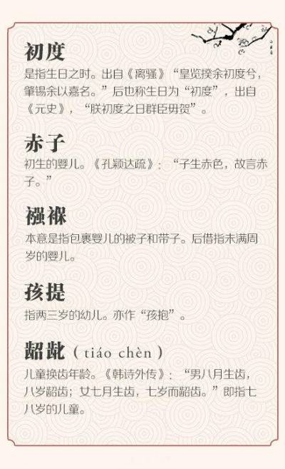
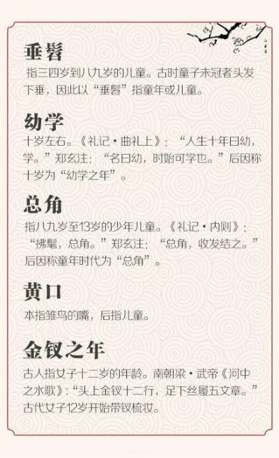
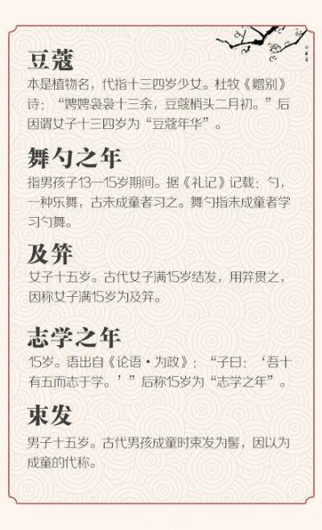
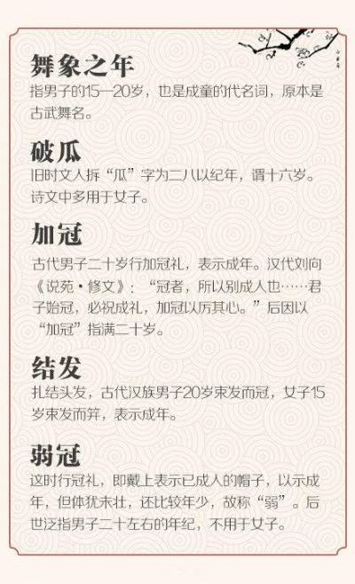
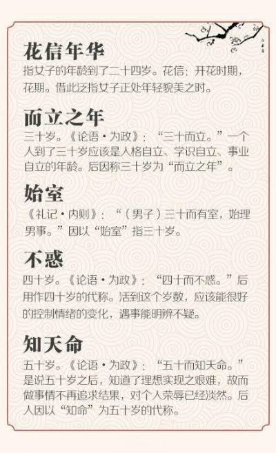
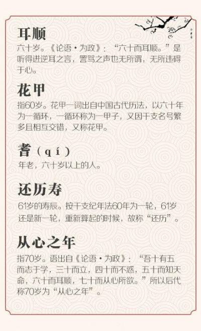
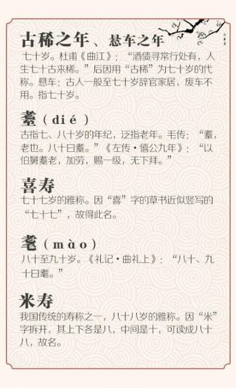
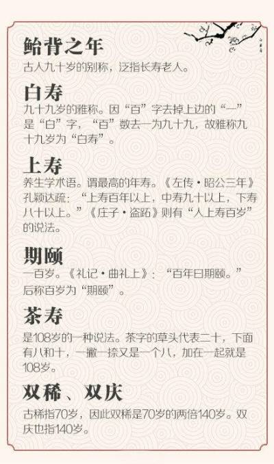

# 小学教育 - 语文
## 国学
* 中国古代年龄称谓
  <table>
    <tr>
      <td></td>
      <td></td>
    </tr>
    <tr>
      <td></td>
      <td></td>
    </tr>
    <tr>
      <td></td>
      <td></td>
    </tr>
    <tr>  
      <td></td>
      <td></td>
    </tr>
  </table>